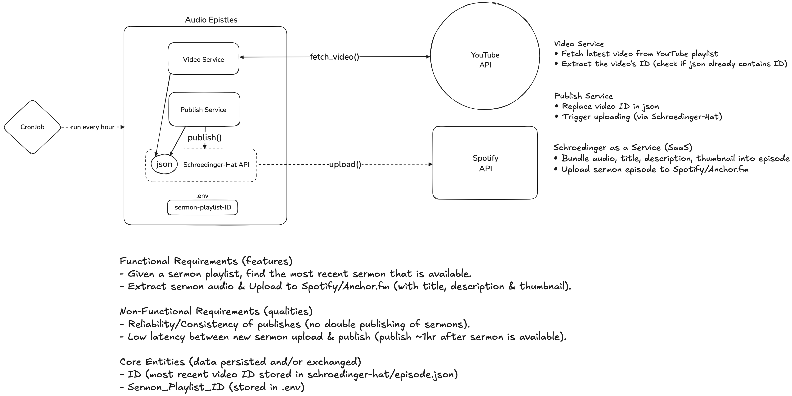

# Audio Epistles


An automated service for fetching the latest video from a YouTube playlist, extracting its ID, and publishing the audio to Spotify/Anchor.fm via the Schroedinger-Hat API. The service is designed to run periodically (e.g., every hour via cron), ensuring new podcasts are published reliably.

## Architecture



- **Video Service:** Fetches the latest video ID from a YouTube playlist.
- **Publish Service:** Updates the local JSON state and triggers the Schroedinger-Hat API to process and uploads to Spotify.
- **Schroedinger-Hat API:** Bundles audio, title, description, and thumbnail, then uploads the episode to Spotify/Anchor.fm.
- **CronJob:** Triggers the application every hour.

## Features/Qualities

- **Automated Fetch & Publish:** Finds the most recent sermon in a predetermined playlist and publishes it to Spotify.
- **Low Latency:** Publishes new sermons within ~1 hour of playlist upload.
- **No Double Publishing:** Keeps track of the last published video to avoid duplicates.

## File Structure

```
audio_epistles/
├── schroedinger-hat/       # Handles publishing to Spotify/Anchor.fm
├── src/
│   ├── main.rs             # Entry point - orchestrates fetch and publish
│   ├── publish.rs          # Updates JSON and triggers Schroedinger-Hat API
│   └── video.rs            # Fetches latest video ID from YouTube
├── .env                    # Stores sermon playlist ID (alongside Spotify credentials)
├── Cargo.toml
├── LICENSE
└── README
```

## Requirements

- Rust
- FFMPEG
- Node (v20+)

## Setup

**Clone and Setup Repo**

```
git clone https://github.com/chornge/audio-epistles.git
cd audio-epistles
touch .env
```

Copy into .env (and replace with appropriate values)

```
SPOTIFY_EMAIL=email@spotify.com
SPOTIFY_PASSWORD=password@spotify
SERMON_PLAYLIST_ID=playlist@id
```

## Automation

To run every hour, add this to your crontab (crontab -e)

```
0 * * * * cd ~/RustProjects/audio-epistles && cargo run --release >> cron.log 2>&1
```

## Build & Run App

```
cargo build --release
cargo run --release
```

## License

MIT

## Special Thanks

A special shout-out to the authors and contributors of [Schroedinger-Hat](https://github.com/Schroedinger-Hat/youtube-to-spotify), whose work powers the publishing and audio processing for this project.

Your efforts in building and maintaining Schroedinger-Hat make seamless sermon publishing possible. Thank you for your dedication and open-source spirit!
