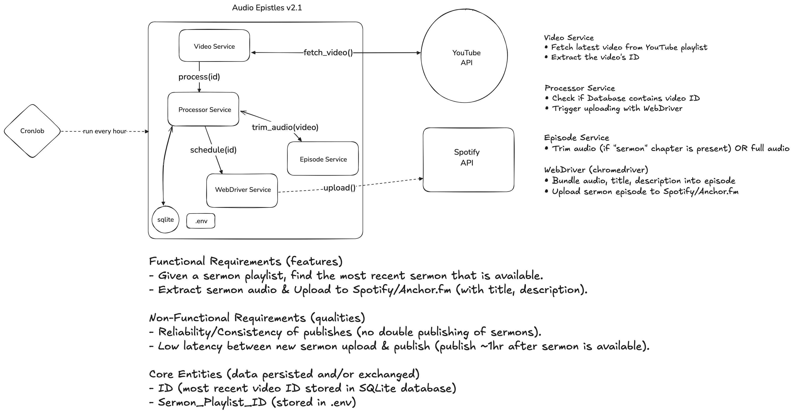

# Audio Epistles


An automated service for fetching the latest video from a YouTube playlist, extracting its details, and publishing the audio to Spotify/Anchor.fm. The service is designed to run periodically (e.g., every hour via cron), ensuring new podcasts are published reliably.

## Architecture



- **Video Service:** Fetches the latest video ID from a YouTube playlist.
- **Publish Service:** Updates the local JSON state.
- **Episode Service:** Extracts sermon chapter, trims audio and stores file.
- **Scheduler Service:** Bundles audio file, title, description then uploads the episode to Spotify/Anchor.fm.
- **CronJob:** Triggers the application every hour.

## Features/Qualities

- **Automated Fetch & Publish:** Finds the most recent sermon in a predetermined playlist and publishes it to Spotify.
- **Low Latency:** Publishes new sermons within ~1 hour of playlist upload.
- **No Double Publishing:** Keeps track of the last published video to avoid duplicates.

## File Structure

```
audio_epistles/
├── src/
│   ├── episode.rs          # Extracts and trims audio
│   ├── main.rs             # Entry point
│   ├── publish.rs          # Updates JSON and triggers scheduler
│   ├── scheduler.rs        # Handles publishing to Spotify/Anchor.fm
│   └── video.rs            # Fetches latest video ID from YouTube
├── .env                    # Stores sermon playlist ID
├── episode.json            # Stores recently published episode
├── Cargo.toml
├── LICENSE
└── README
```

## Requirements

- Rust
- FFMPEG (`brew install ffmpeg`)
- yt-dlp (`brew install yt-dlp`)

## Setup

**Clone and Setup Repo**

```
git clone https://github.com/chornge/audio-epistles.git
cd audio-epistles
touch .env
```

Copy the following into .env and replace with the appropriate values - Unsecure!

```
SPOTIFY_EMAIL=email@spotify.com
SPOTIFY_PASSWORD=password@spotify
SERMON_PLAYLIST_ID=playlist@id
```

More secure way is to host on Github/GitLab and store sensitive info as secrets.

## Automation

To run every hour, add this to your crontab (crontab -e)

```
0 * * * * cd audio-epistles && cargo run --release >> cron.log 2>&1
```

## Build & Run App

```
cargo build --release
cargo run --release
```

## License

MIT

## Special Thanks

A special shout-out to the authors and contributors of [Schroedinger-Hat](https://github.com/Schroedinger-Hat/youtube-to-spotify), whose work directly inspired this project.

Your efforts in building and maintaining youtube-to-spotify make seamless publishing possible. Thank you for your dedication and open-source spirit!
